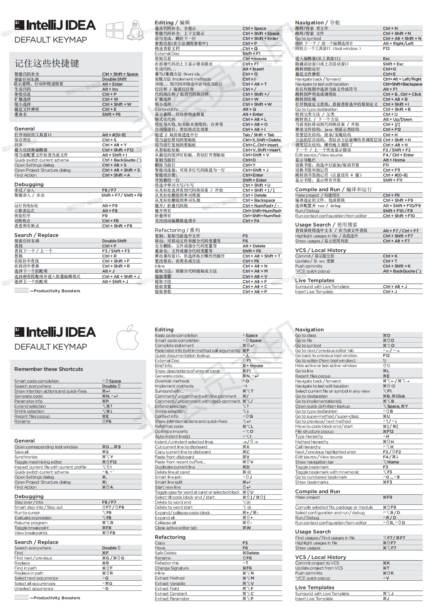

# IDEA 快捷键图谱
[官方文档- IDEA 快捷键](https://www.jetbrains.com/help/idea/2020.2/mastering-keyboard-shortcuts.html)
中有一个 [默认的键盘映射参考卡](https://resources.jetbrains.com/storage/products/intellij-idea/docs/IntelliJIDEA_ReferenceCard.pdf?_ga=2.31254143.1186071345.1596509455-217560053.1584063392)
，里面列出了常用的一些快捷键，包含 windows 和 mac 的，认真看了下感觉大部分的确是常用的，由于是英文，就花了几个小时汉化了一下，下面是对应的文件

以下文件，就在本项目根目录，可以直接下载查看

- [IntelliJIDEA_ReferenceCard.pdf](./IntelliJIDEA_ReferenceCard.pdf) 英文原版
- [IntelliJIDEA_ReferenceCard_wrapper_zh.pdf](./IntelliJIDEA_ReferenceCard_wrapper_zh.pdf) 汉化版
  
  
windows 和 mac 由于只有快捷键不一样，暂时只汉化了 windows 的说明，
mac 的说明还未使用汉化好的替换掉，如果有需要，可以下载本文件通过福星阅读器修改该 PDF，然后 PR ，我进行合并

下面是 PDF 的图片，由于不是会员，导出的有水印，有人是会员也可以帮忙导出一个无水印的

