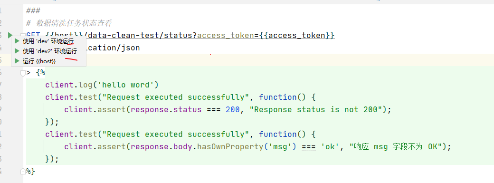
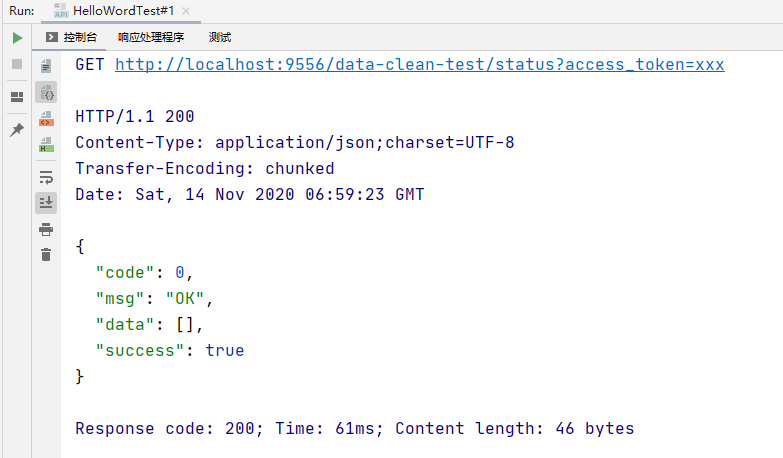
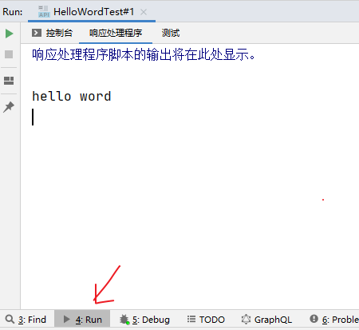
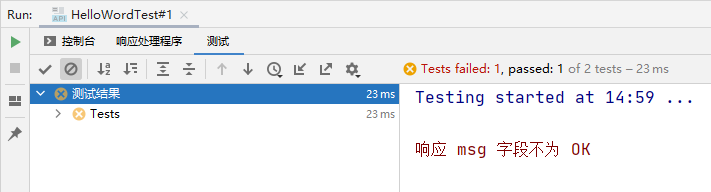

# 测试 RESTful Web 服务

[官网文档](https://www.jetbrains.com/help/idea/2020.2/testing-restful-web-services.html)

总来说，比较方便，可以直接在 IDEA 中编写接口的测试逻辑。由于官网文档该功能也比较简单。这里简单讲解下。

简单来说有如下的好处：

- 在文本文件中直接写请求，如果是对 controller 进行测试，在写路径或则参数的时候直接有代码补全提示
- 可以很方便的对响应数据进行断言处理，也就是可以加一些脚本
- 还测试环境功能，比如配置开发环境的服务器 host

**HTTP Client** 插件默认是激活的，也就是可以直接使用。

看下面一个例子的目录组成：

```
|- 项目根目录
 |- rest-test	# 自己起的一个目录名称
   |- HelloWordTest.http			# http 接口测试脚本，名称随意，后缀用 .http 结束
   |- http-client.env.json			# 环境参数配置
```

下面是具体的文件内容

HelloWordTest.http

```
###
# 数据清洗任务状态查看
GET {{host}}/data-clean-test/status?access_token={{access_token}}
Accept: application/json

> 

###
# 三个`###` 表示新开一个接口测试
GET {{host}}/data-clean-test/status?access_token={{access_token}}
Accept: application/json
```

http-client.env.json

```
{
  "dev": {
    "host": "localhost:9556",
    "access_token": "xxx"
  },
  "dev2": {
    "host": "localhost:8080",
    "access_token": "xxx"
  }
}
```



如上图，直接就可以运行，环境配置文件里面，第一级表示环境，后面的参数就是你的环境变量了。

HTTP响应处理程序脚本是用JavaScript [ECMAScript 5.1](https://www.ecma-international.org/ecma-262/5.1/)编写的，编码帮助和文档由捆绑的 `HTTP Response Handler` 库处理。该库公开了两个对象，用于组成响应处理程序脚本：

- client
- response：表示响应对象

这两个对象可以直接在脚本域中使用。关于他们的 API 和一些示例用法，直接看 [官方文档的说明](https://www.jetbrains.com/help/idea/2020.2/http-response-handling-api-reference.html)

运行后，会在 Run 标签页中显示运行结果，如下图



如果写了脚本处理程序，里面的输出信息则可以在这里查看



如果使用了断言，则会在这里显示测试结果

